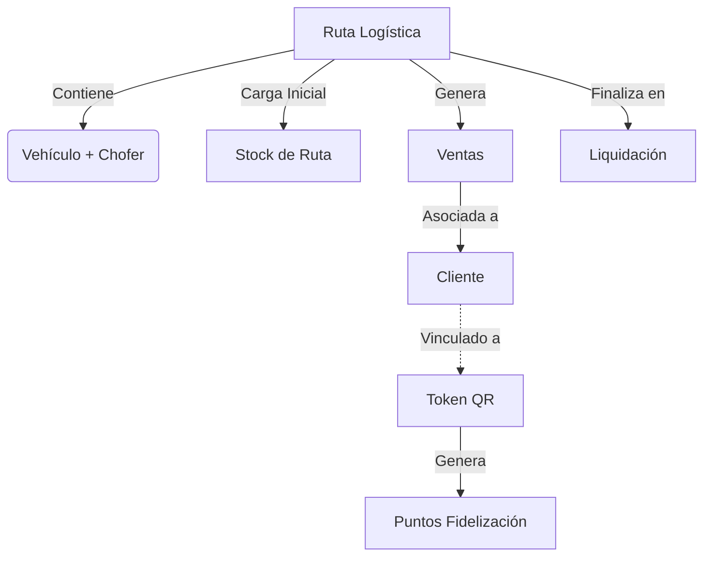

# Guía de Integración Frontend - Siglo F (Backend v2)

Este documento detalla cómo consumir el API actualizado, entendiendo las relaciones de negocio y cómo mostrarlas en la interfaz.

## 1. Modelo Mental para el Frontend

El sistema no es plano. Debes entender la jerarquía para armar la UI:



### Regla de Oro UI:
*   **El Chofer NUNCA ve "Productos" sueltos**: Ve su **"Stock de Ruta"**. No puede vender más de lo que tiene asignado.
*   **El Cliente tiene "Estado Comercial"**: Si el status es `ALERTA` (Rojo), mostrar warning al vender.

---

## 2. Diccionario de Datos & Enums (Nuevos)

Dropdowns que debes implementar hardcoded o mapeados:

| Enum | Valores | Color UI Sugerido |
| :--- | :--- | :--- |
| `ClientType` | `RESTAURANTE` <br> `CONVENCIONAL` | 🏢 Indigo <br> 🏠 Green |
| `CommercialStatus` | `ACTIVO` <br> `FRECUENTE` <br> `ALERTA` | ✅ Green <br> ⭐ Gold <br> 🚨 Red (Blinking) |
| `TokenStatus` | `DISPONIBLE` <br> `ASIGNADO` <br> `INVALIDADO` | ⚪ Gray <br> 🔵 Blue <br> ⚫ Black |
| `LiquidationStatus`| `PENDING` <br> `APPROVED` | ⏳ Orange <br> ✅ Green |

---

## 3. Flujos Críticos & Payloads

### A. Registro de Venta (Con GPS)
**Pantalla:**  Chofer > "Nueva Venta".
**Uso:** El chofer está frente al cliente. El navegador debe capturar `navigator.geolocation`.

**POST** `/api/v1/sales`
```json
{
  "routeId": 105,
  "clientId": 45,
  "paymentMethod": "EFECTIVO",
  "latitude": -12.046374,    // <--- NUEVO: OBLIGATORIO SI DISPONIBLE
  "longitude": -77.042793,   // <--- NUEVO
  "items": [
    { "productId": 1, "quantity": 2 }
  ]
}
```

### B. Liquidación (Cierre de Ruta)
**Pantalla:**del Chofer > "Cerrar Día".
**Lógica:** El backend *sabe* cuánto vendió. El chofer solo reporta **cuánto stock le sobró (físico)**.

**POST** `/api/v1/liquidation/close`
```json
{
  "routeId": 105,
  "savedStock": [
     // "Me sobraron 5 balones llenos"
     { "productId": 1, "quantity": 5 }
  ]
}
```
**Respuesta (Liquidation):**
El backend calcula el dinero esperado.
```json
{
  "id": 88,
  "totalCash": 1500.00,       // Dinero que DEBE entregar
  "totalDigital": 500.00,     // Yape/Plin vefiricado
  "status": "PENDING"         // Esperando aprobación de Admin
}
```

### C. Gestión de Clientes (Backoffice)
**Pantalla:** Admin > Clientes > Crear/Editar.

**GET / POST / PUT** `/api/v1/clients`
```json
{
  "fullName": "Pollería El Rey",
  "type": "RESTAURANTE",              // <--- Nuevo Enum
  "commercialStatus": "FRECUENTE",    // <--- Nuevo Enum
  "tokenQr": {                        // <--- Vinculación Opcional
      "code": "UUID-DEL-QR-PEGADO",
      "status": "ASIGNADO"
  },
  "latitude": -12.00,
  "longitude": -77.00
}
```

---

## 4. Visualización en Tablas (Backoffice)

### Lista de Liquidaciones
Al mostrar liquidaciones, **no muestres solo IDs**.
*   **Columna Estado:** Badge de color (`PENDING` = Naranja).
*   **Columna Aprobado Por:** Si `status === APPROVED`, muestra `liquidation.approvedBy.username`.
*   **Estilo:** Si hay diferencia entre lo vendido y el dinero entregado (feature futura), resaltar la fila en rojo tenue.

### Auditoría (Ojo de Dios)
Recuerda parsear el campo `details` (ver guía anterior).
*   Si la acción es `CLOSE_ROUTE`, el detalle mostrará qué stock se devolvió.
